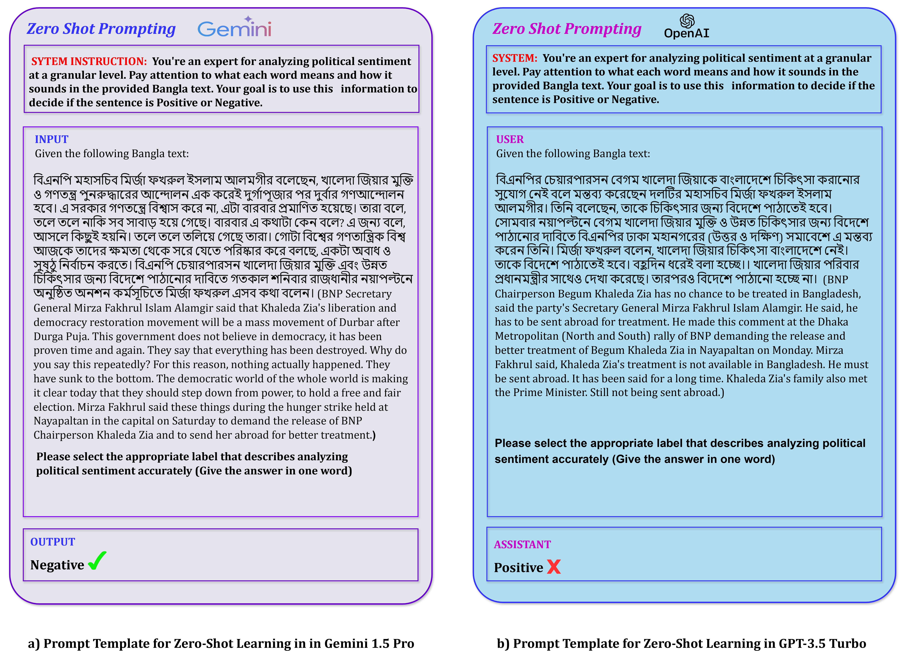

# Motamot: A Dataset for Revealing the Supremacy of Large Language Models over Transformer Models in Bengali Political Sentiment Analysis

## Abstract


## Table of Contents
- [Proposed Methodology](#experimental-methodology)
- [Dataset Availability](#dataset-availability)
- [Results](#results)
- [Contact Information](#contact-information)
- [Citation](#citation)


## Proposed Methodology


    
## Dataset Availability

We called the dataset "Motamot" in Bengali (মতামত) and in English (Opinion). It was meticulously compiled from a range of online newspapers focusing on political events and conversations during Bangladeshi elections. Our data collection process involved scraping articles and opinion pieces from reputable news sources, ensuring a diverse and representative sample of political discourse. "Motamot" gives a broad look into the many opinions and conversations that shape Bangladesh's political environment. The dataset can be accessed from [here](https://data.mendeley.com/datasets/hdhnrrwdz2/1).

### Specifics of the Core Data:

|                  | Train | Test | Validation |
|------------------|-------|------|------------|
| **Total**        | 5647  | 706  | 705        |
| **Positive**     | 3306  | 413  | 413        |
| **Negative**     | 2341  | 293  | 292        |

### Train Data:

|           | Positive | Negative |
|-----------|----------|----------|
| **Count** | 3306     | 2341     |

### Test Data:

|           | Positive | Negative |
|-----------|----------|----------|
| **Count** | 413      | 293      |

### Validation Data:

|           | Positive | Negative |
|-----------|----------|----------|
| **Count** | 413      | 292      |


## Results
### Comparative Analysis of Pre-trained Language Models for Different Performance Metrics

| Model         | Accuracy | Precision | Recall  | F1-Score |
|---------------|----------|-----------|---------|----------|
| **BanglaBERT**| **0.8204** | **0.8222** | **0.8204** | **0.8203** |
| Bangla BERT Base | 0.6803 | 0.6907 | 0.6812 | 0.6833 |
| DistilBERT    | 0.6320   | 0.6358    | 0.6320  | 0.6317   |
| mBERT         | 0.6427   | 0.6496    | 0.6428  | 0.6153   |
| sahajBERT     | 0.6708   | 0.6791    | 0.6709  | 0.6707   |


### Comparative Analysis of Large  Language Models for Different Performance Metrics

| LLMs   | Metric    | Zero-shot | 5-shot | 10-shot | 15-shot |
|--------|-----------|-----------|--------|---------|---------|
| GPT 3.5 Turbo | Accuracy  | 0.8500    | 0.8900 | 0.9133  | **0.9400** |
|              | Precision | 0.8467    | 0.8867 | 0.9200  | **0.9467** |
|              | Recall    | 0.8533    | 0.8926 | 0.9079  | **0.9342** |
|              | F1-Score  | 0.8495    | 0.8896 | 0.9139  | **0.9404** |
| Gemini 1.5 Pro | Accuracy  | 0.8608    | 0.8981 | 0.9200  | **0.9633** |
|              | Precision | 0.8931    | 0.8846 | 0.9333  | **0.9667** |
|              | Recall    | 0.8477    | 0.9205 | 0.9091  | **0.9603** |
|              | F1-Score  | 0.8698    | 0.9022 | 0.9211  | **0.9635** |


## Contact Information

For any questions, collaboration opportunities, or further inquiries, please feel free to reach out:

- **Fatema Tuj Johora Faria**
  - Email: [fatema.faria142@gmail.com](mailto:fatema.faria142@gmail.com)

- **Mukaffi Bin Moin**
  - Email: [mukaffi28@gmail.com](mailto:mukaffi28@gmail.com)

- **Rabeya Islam Mumu**
  - Email: [rabeya.islammomo@gmail.com](mailto:rabeya.islammomo@gmail.com)
    
- **Md Mahabubul Alam Abir**
  - Email: [mahbubabir09@gmail.com](mailto:mahbubabir09@gmail.com)
- **Abrar Nawar Alfy**
  - Email: [abraralfy49@gmail.com](mailto:abraralfy49@gmail.com)
    
## Citation

<!--If you find the dataset or the associated research work helpful, please consider citing our paper: -->

```bibtex
@misc{faria2024unraveling,
      title={Unraveling the Dominance of Large Language Models Over Transformer Models for Bangla Natural Language Inference: A Comprehensive Study}, 
      author={Fatema Tuj Johora Faria and Mukaffi Bin Moin and Asif Iftekher Fahim and Pronay Debnath and Faisal Muhammad Shah},
      year={2024},
      eprint={2405.02937},
      archivePrefix={arXiv},
      primaryClass={cs.CL}
} 


